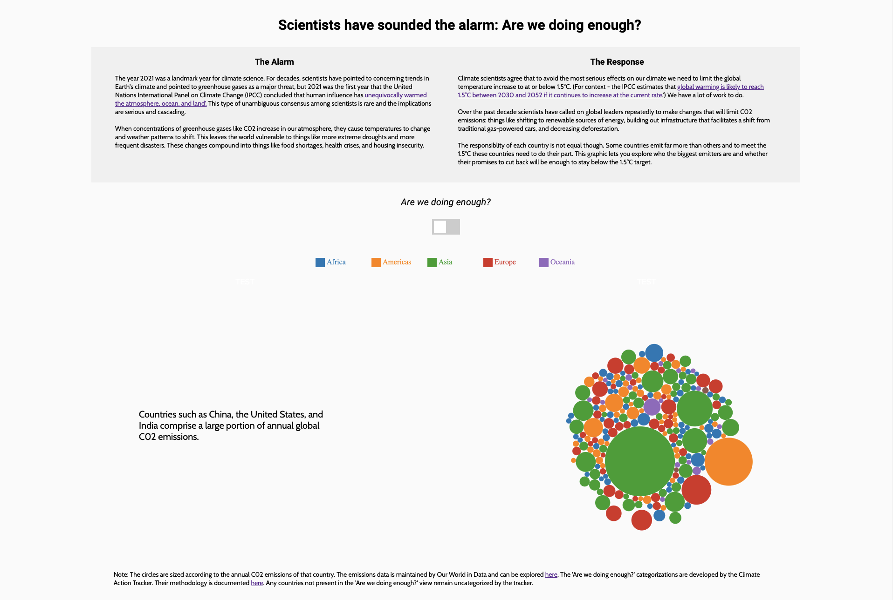
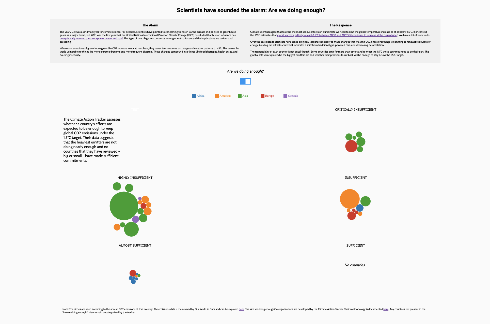
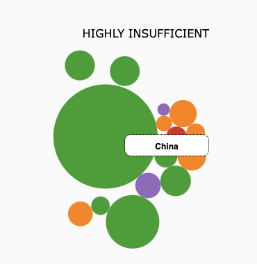

INFO 616 - Final Project
===============

Interactive climate change graphic
---------------------

The code in this folder creates a visualization that illustrates the urgent
situation Earth's climate faces and lets readers examine whether countries are
doing enough to change and limit their negative climatic impact.

The visualization opens on the following view of all countries sized by their
CO2 emissions and colored by their continent. In this view you can see that a
few countries contribute the vast majority of emissions. You can see the
country name by hovering.

When you click on the 'Are we doing enough?' button the visualization shifts,
grouping countries by whether their efforts will be sufficient or insufficient
at meeting the 1.5 degree Celsius target explained in the introductory
paragraphs of the viz. This view shows that no countries are sufficient and
that the heaviest emitters have the most work to do.

The below visualization demonstrates the tooltip functionality.

The code is divided into three files:
- index.html: This outlines the overall structure of the page, creating places
  for the title, paragraphs, graphics, legend, and footnotes to be inserted.
  Except for the footnote, title, and introductory paragraphs, nothing is
  hardcoded.
- graphic.js: This is where the code that governs all interactivity lives. The
  file recursively adjusts the page structure depending on the number of force
  networks that need to be drawn and adjusts the explanatory paragraph
  depending on the view. The code is modularized into functions that are called
  in a cascade when the data loads.
- main.css: This is where almost all the styling lives (except for some that is
  dependent on the data which is executed directly in graphic.js)

Data Sources:
[C02 emissions](https://github.com/owid/co2-data)
[Sufficiency of efforts](https://climateactiontracker.org/methodology/cat-rating-methodology/)
