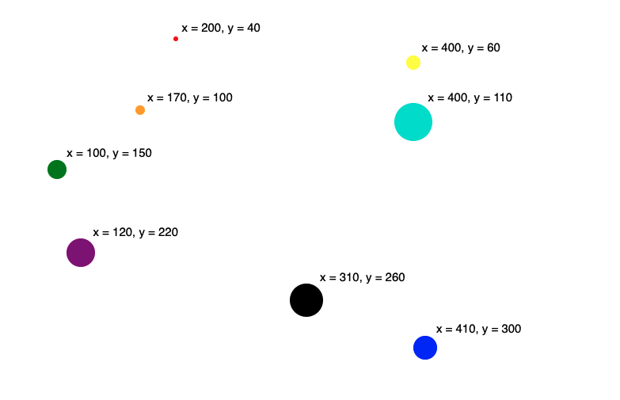

Week 2 Homework
===============

D3 Bubble Chart
---------------------

The visualization in this folder is a bubble chart. Each point is colored and
sized according to its position in the array. Labels are positioned just off
the top righthand corner of each circle's boundary, accounting for the
variation in bubble sizes.

Here is an image of how that displays:

