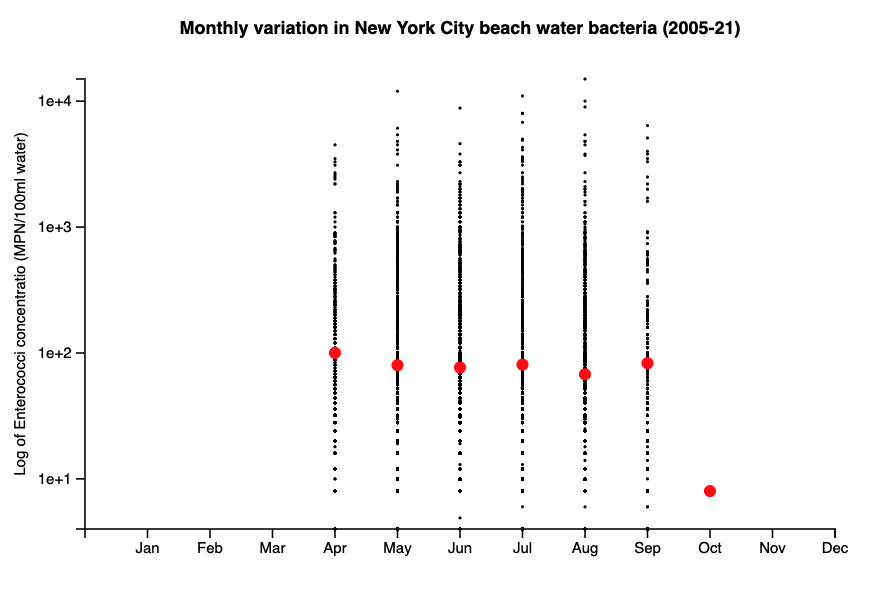

Week 3 Homework
===============

D3 normalized scatter histogram with binned averages
---------------------

The visualization in this folder is a modified scatter plot of bacterial
samples from New York City beaches. The chart enables the viewer to assess historic
monthly variation in the bacterial concentration found in New York City's
public water bodies. The chart can be thought of as a series of histograms rotated by
90 degrees. Because of the severe right skewness of bacterial concentrations,
the y-axis reflects the log transform of the original measured concentration. The
average bacterial concentration for each month is plotted in red, while the
original samples are plotted in black. I typically clean and analyze data in
Python, but I kept all cleaning and manipulation in JavaScript to practice
.filter(), .map(), forEach(), .reduce(), and date formatting.

The chart reveals that samples are only taken between late spring and early
fall. The average concentration stays constant each month around 100 MPN/100ml, but there
is monthly variation in the right tail of the samples (ie. the samples which have
unusually high concentrations of bacteria). Unsually high concentrations are
more common in summer months than they are in September and April.

Data Source: [DOHMH Beach Water Quality Data](https://data.cityofnewyork.us/Health/DOHMH-Beach-Water-Quality-Data/2xir-kwzz/data)

Here is an image of how that displays:

