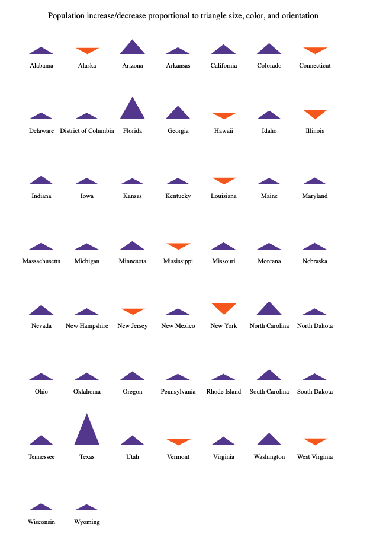

Week 4 Homework
===============

D3 SVG Exploration - Ingredients for a Spike Map
---------------------

The code in this folder visualizes the 2018-19 state-level population change
using triangles. Each state is represented by a triangle that is stretched in
length proportional to the population increase or decrease. The triangle is
oriented pointing downwards for states that saw a population decrease and
upwards for states that saw a population increase. This is also captured in the
color: purple for increase and orange for decrease. I wrote the code such that
the triangles all have the same baseline regardless of orientation.

I was inspired to make this visualization because it's an important stepping
stone for a [spike map](https://blog.datawrapper.de/spikemaps/).

Data Source: [U.S. Census Bureau](https://www.census.gov/data/tables/time-series/demo/popest/2010s-state-total.html#par_textimage)

Here is an image of how the final visualization displays:

