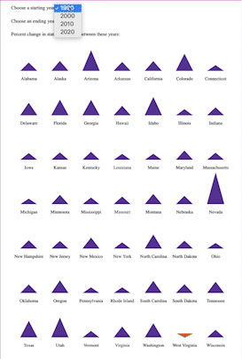

Week 7 Homework
===============

D3 Interactivity - Ingredients for a Spike Map - Now animated!
---------------------

The code in this folder extends the visualization that I completed for HW 4. It
lets the user enter two decades and calcalulates the percent population change at the
state level between those decades. Like in HW4, each state is represented by a triangle that is stretched in
length proportional to the population increase or decrease. The triangle is
oriented pointing downwards for states that saw a population decrease and
upwards for states that saw a population increase. This is also captured in the
color: purple for increase and orange for decrease.

The visualization is initialized to calculate the percent change between
1990 and 2020, and updates each time the user changes either the start or
ending decade dropdowns. If the user tries to select a start year that is the
same as the end year or after it, it alerts the user to select a different
decade and reverts back to the previous selection (which are saved every time
the user mouseovers the selection form).

When the user selects a valid combination of decades the animation first
stretches the triangles to the new lengths and then rotates and colors them. I
think this two-step animation helps first call out which states saw a major change and
then calls out which states flipped from increasing to decreasing (or vice
versa). Making both of those changes at once is too much for the user to
follow.

I still think this visualization is an important stepping
stone for a [spike map](https://blog.datawrapper.de/spikemaps/). This extension
of HW4 now gives me the ingredients I need to make an interactive version of
this map (where there is one spike per county just positioned according to its lat/long.)

Data Source: [U.S. Census Bureau](https://www.census.gov/data/tables/2020/dec/2020-apportionment-data.html)

Here is an image of how the final visualization displays:

