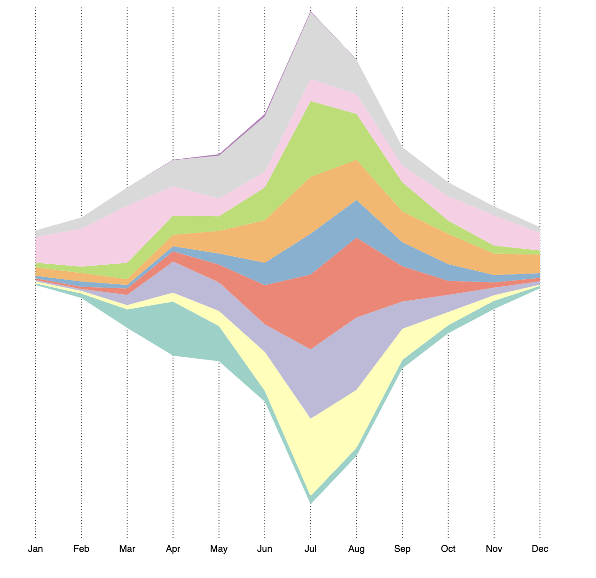

Week 8 Homework
===============

D3 Steamgraph - Exploring the cycle of wildfire season across the US
---------------------

The code in this folder creates a steamgraph that tracks the number of 
wildfires in each [GACC administrative region of the
US](https://gacc.nifc.gov/). I created the dataset necessary for this chart
starting with the [Wildland Fire Interagency Geospatial Services (WFIGS) Group's
database](https://data-nifc.opendata.arcgis.com/search?tags=Category%2Chistoric_wildlandfire_opendata) of all US wildfires that occurred between 2015 and 2020. In python
(see jupyter notebook) I extracted the month of each fire and grouped them by
region and month. This is the dataset used in the visualization.

The visualization itself lets you explore the cycle of wildfire season: when it
is most intense and where across the year it hits the most. For example, you
can see with this chart that fire season is heaviest in the summer, and if you
hover over the areas to explore each region you can see that the South makes up
a lot of the fires between January and May, but then improves over the summer,
while regions in the West pick up over the summer, but are inactive over the winter.

I did not append a y-axis to this chart because I don't think it's purpose is
to tell users exactly how many fires each region saw, but just which saw more
and which saw less. If I were aiming for it to be a reference tool I would not
have chosen a steamgraph.

Here is an image of how the final visualization displays without tooltips:

And one with tooltips: 

These were some steamgraph examples the inspired me along the way:
[Ex 1](https://observablehq.com/@d3/streamgraph)
[Ex 2](https://www.d3-graph-gallery.com/graph/streamgraph_template.html)