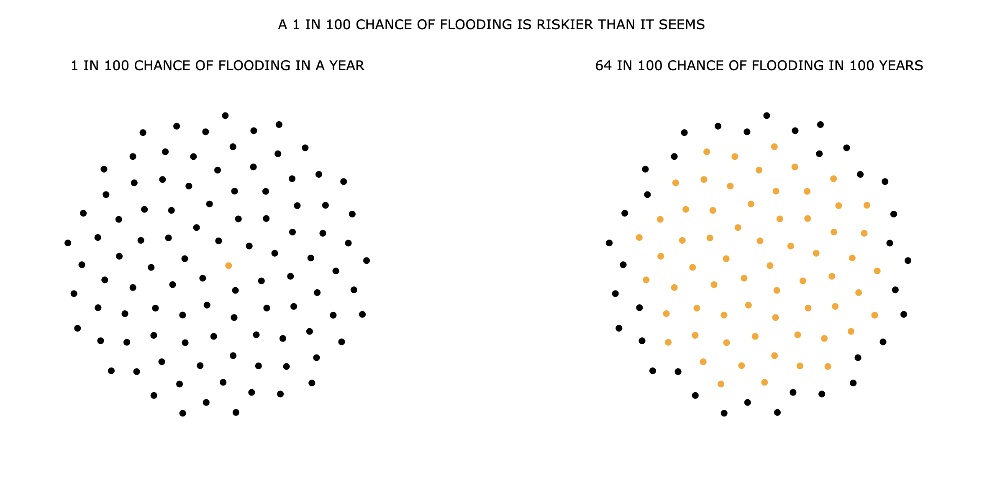

Week 9 Homework
===============

D3 Force Network - Visualizing the underestimation of high risk floodplains
---------------------

The code in this folder creates two side-by-side force networks that visualize
how yearly probability compounds. FEMA defines a high risk floodplain as one
that has a 1 in 100 risk of flooding. Many underestimate this to mean that a
house in these floodplains has a 1% risk of flooding in 100 years. This is not
the case because of how probability compounds. I [created a scrollytelling
visualization in ArcGIS](https://storymaps.arcgis.com/stories/8d2bb89b23cc4ba09cf08c4b052ff67c) that tried to communicate this, and for
this project I decided to recreate it in d3.

I was particularly interested in creating this visualization because it forced
me to figure out how to modularize my force network code so that it could be repeatedly
called within multiple side-by-side divs. 

I also think visualizations of this
form (ie. clustered dots) are effective at explaining probability to a
non-technical audience and I was
interested to explore a non-traditional application of force networks (ie. one
that
doesn't use traditional network data). I created my own dataset using JavaScript.

The final visualization looked like this:
